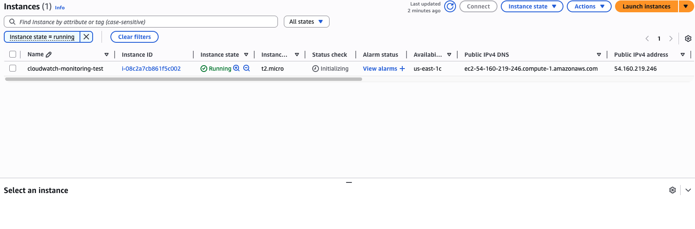
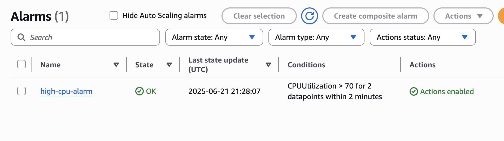
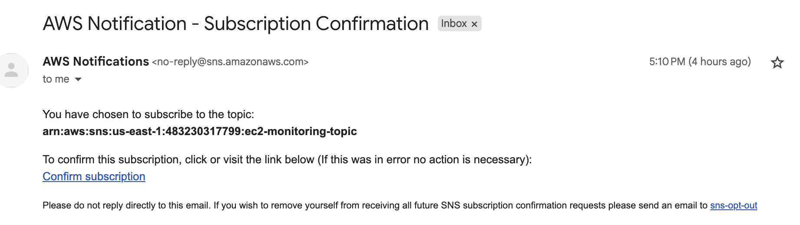

# 🚀 AWS Cloud Monitoring with CloudWatch & SNS

This project shows how to monitor an EC2 instance using **Amazon CloudWatch** and send an email alert using **SNS** when the CPU gets too high.

---

## 📌 What This Project Does

- Creates an EC2 virtual machine (Linux)
- Watches the CPU usage with CloudWatch
- Sends an alert to your email when usage is high
- Uses SNS (Simple Notification Service) for the alert

---

## 🧰 Tools I Used

- AWS EC2
- AWS CloudWatch
- AWS SNS
- Git, GitHub
- Mac Terminal + GitHub Desktop

---

## 🛠️ How It Works (Diagram)

---

## 📷 Screenshots

### ✅ EC2 Running

### ✅ CloudWatch Alarm

### ✅ SNS Email Alert

---

## ✅ What I Learned

- How to launch a virtual machine in AWS
- How to monitor servers with CloudWatch
- How to send alerts using SNS
- How to create a GitHub project to show my work

---

## 🔜 Next Steps

- Try auto-scaling with alarms
- Use Lambda to auto-restart EC2 if alarm triggers
- Automate everything with Terraform

---

## 👩‍💻 About Me

I'm **Aditi Rohit**, learning Cloud & DevOps and creating a portfolio as a **Cloud Support Engineer**.

📫 [LinkedIn](https://www.linkedin.com/in/aditi-rohit-702518b4/)  
🌐 [GitHub](https://github.com/aditirohit)
